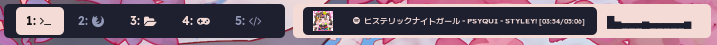
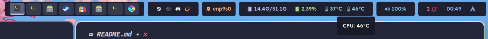
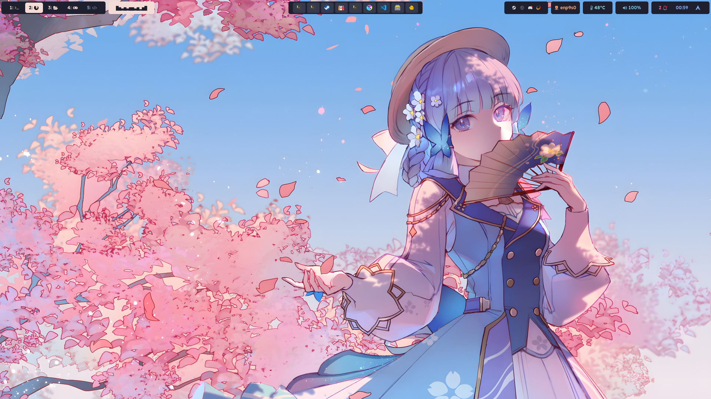

# Getting Started

## Dependancies

TODO: wip sorry

- `playerctl`
- `jq`
- for update tracking: `paru` (modify `modules/updates.sh` for a different AUR helper)

Optionals (unused):
- `zscroll`

##

You know the drills : download and extract to your `${XDG_CONFIG_HOME}/waybar`

# Screenshots

screenshot by BLACKmeow(x:@miji_black, p:91709880)

